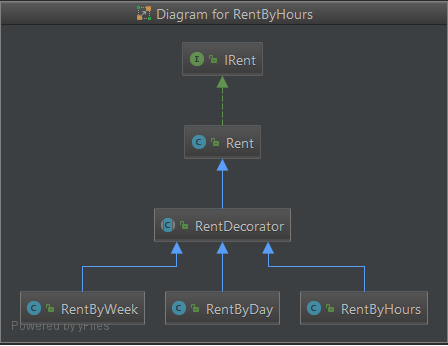

# test-rent-java-decorator
## Ejemplar de un problema aplicando el patrón de diseño decorador y algunas pruebas unitarias

# Requirements
_java7, java8 and maven3_

# The Problem:
A company rents bikes under following options:

1. Rental by hour, charging $5 per hour
2. Rental by day, charging $20 a day
3. Rental by week, changing $60 a week
4. Family Rental, is a promotion that can include from 3 to 5 Rentals (of any type) with a discount of 30% of the total price

# Assigment:
1. Implement a set of classes to model this domain and logic
2. Add automated tests to ensure a coverage over 85%
3. Use GitHub to store and version your code
4. Apply all the recommended practices you would use in a real project
5. Add a README.md file to the root of your repository to explain: your design, the development practices you applied and how run the tests.

Note: we don't expect any kind of application, just a set of classes with its automated tests.

# Deliverables:
The link to your repository 

## Solution
La aplicación, esta compuesta por 7 clases, cada clase hace una función en especifica pero similar por lo que integra un patrón de diseño que modifica parcialmente la estructura del padre sin afectar a las demas clases hermanas.

## Diagrama UML

 
## Classes:
*IRent:* es una interfaz que ofrece la estructura de los metodos a la clase base Rent.
 
*Rent:* es la clase padre que implemente los metodos necesarios que son utilizados para la categorizacion de las rentas.

*RentDecorator:* Es la clase encargada de encapsular y de mantener la instancia de los objetos instanciados. La clase que herede de esta clase Decorador podra tener la bondad de inyectar dependencias y caracteristicas a partir de una clase nueva.

*RentByDay:* Es la clase que hereda las caracteristica de Rent, solo con la diferencia que sus calculos se realizan por dia.

*RentByHours:* Es la clase que hereda las caracteristica de Rent, solo con la diferencia que sus calculos se realizan por hora.

*RentByWeek:* Es la clase que hereda las caracteristica de Rent, solo con la diferencia que sus calculos se realizan por semana.

*RentConsts:* Es la clase encargada de definir las propiedades o valores estaticos de la aplicación.

## Test
*AppTest:* En esta clase se realizan las pruebas unitarias bajos los siguientes metodos:

*testHour:* ejemplo de resultado pasando por parametro 1 hora y obteniendo como resultado 5.0.

*testDay:* ejemplo de resultado pasando por parametro 1 dia y obteniendo como resultado 20.0.

*testWeek:* ejemplo de resultado pasando por parametro 1 semana y obteniendo como resultado 60.0.

*testFamily:* ejemplo usando el plan familiar pasando por parametro 1 time, en representación de la semana, dia u hora obteniendo como resultado 59.5 equivalente al descuento del 30% por las 3 rentas según la condición establecida.
        
        // Inyectando 3 dependencias
        Rent rent = new RentByWeek(new RentByDay(new RentByHours(new Rent())));    
    
*testFamilyTwo:* ejemplo usando el plan familiar pasando por parametro 1 time, en representación de la semana, dia u hora obteniendo como resultado 25.0, por ser inferior a las 3 rentas, segun la logica no hay un descuento porcentual.
    
         // inyectando 2 dependencias
         Rent rent = new RentByDay(new RentByHours(new Rent()));    

*testFamilySix:* ejemplo usando el plan familiar pasando por parametro 1 time, en representación de la semana, dia u hora obteniendo como resultado 170.0, por ser superior a las 5 rentas, segun la logica no hay un descuento porcentual del 30%.
    
         // inyectando 6 dependencias
         Rent rent = new RentByWeek(new RentByDay(new RentByHours(new RentByWeek(new RentByDay(new RentByHours(new Rent()))))));
    
